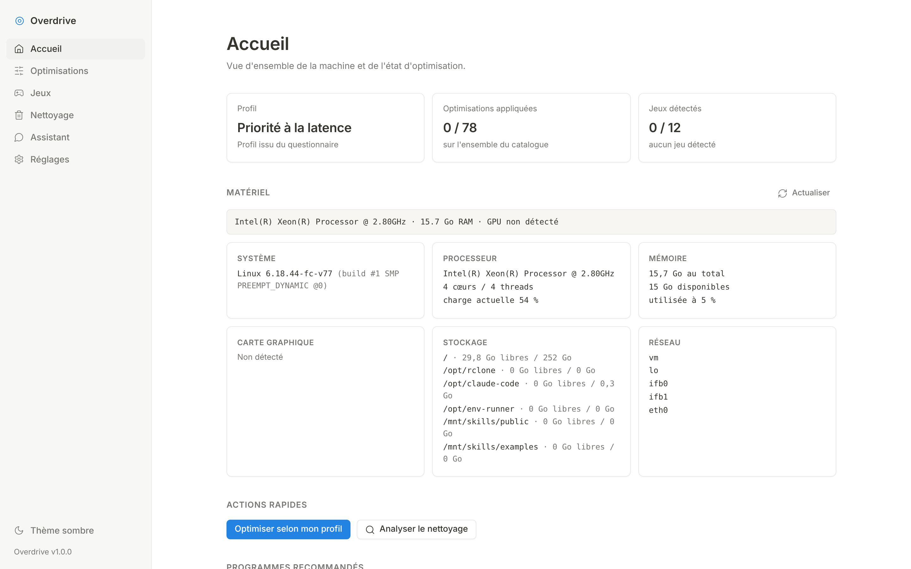
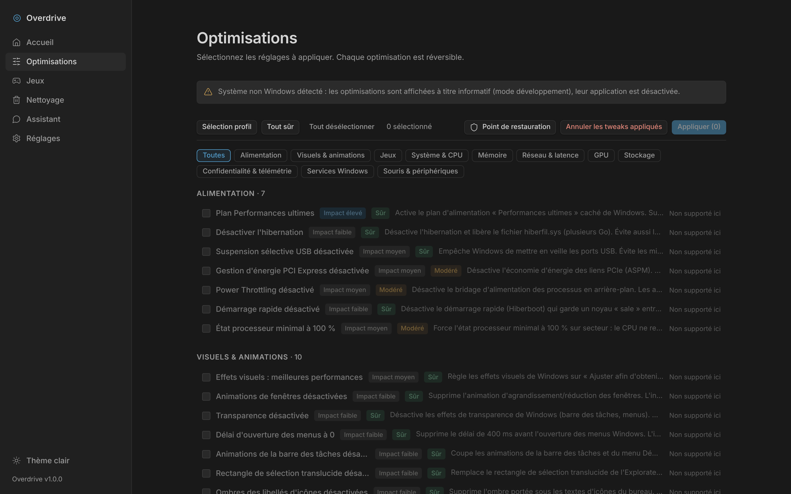
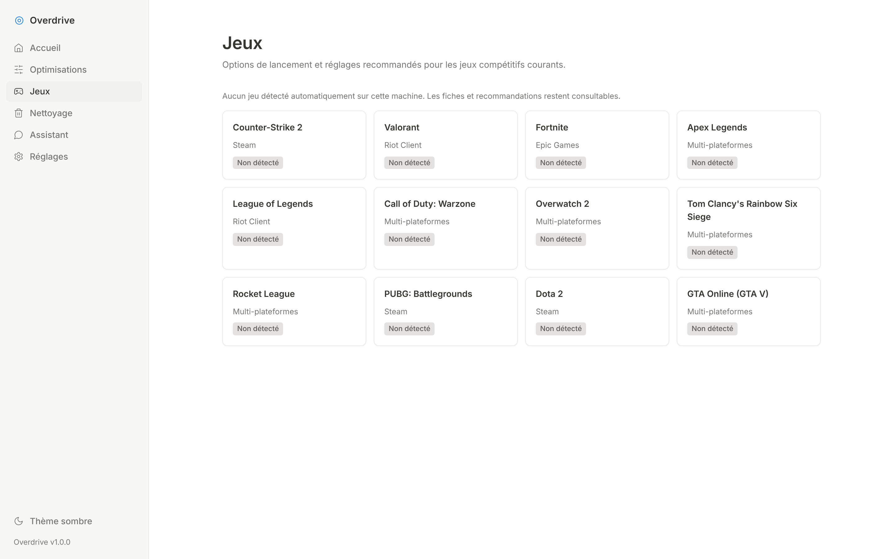

# Game Booster

**Overdrive, l'optimiseur PC gaming tout-en-un pour Windows 10/11.** Plus de
78 optimisations système réversibles, 12 jeux pris en charge (CS2, Valorant, …),
moniteur temps réel, nettoyage de caches, programmes recommandés, détection
matériel et assistant IA — dans une interface claire inspirée de Notion,
disponible en français et en anglais, 100 % locale, sans télémétrie.

*Game Booster is an all-in-one gaming PC optimizer for Windows 10/11: 78
reversible system tweaks, 12 supported games, real-time monitoring, cache
cleanup and an AI assistant — fully local, no telemetry, French and English
interface.*

[](../../actions/workflows/build-exe.yml)
[](../../releases/latest)
[](LICENSE)



| Optimisations (thème sombre) | Jeux |
| --- | --- |
|  |  |

---

## Téléchargement

1. Récupérez `Overdrive.exe` dans la [dernière Release](../../releases/latest).
2. Lancez-le. Windows demande l'élévation administrateur (UAC) : c'est attendu,
   les optimisations modifient des réglages système.
3. Si SmartScreen affiche « Windows a protégé votre ordinateur », cliquez sur
   **Informations complémentaires** puis **Exécuter quand même** (exécutable
   non signé, construit publiquement par GitHub Actions depuis ce dépôt).

Au premier lancement, un questionnaire de 7 questions établit votre profil
(FPS maximum, latence minimale, équilibré ou stream) et présélectionne les
optimisations adaptées.

## Fonctionnalités

### Optimisations — 78 réglages réversibles
Classées en 11 catégories : alimentation, visuels & animations, jeux,
système & CPU, mémoire, réseau & latence, GPU, stockage, confidentialité &
télémétrie, services Windows, souris & périphériques. Chaque réglage affiche
son **impact** (élevé / moyen / faible) et son **niveau de risque**
(sûr / modéré / avancé, avec confirmation obligatoire pour les avancés).
Chaque application est journalisée localement et dispose d'une **annulation
réelle** vers les valeurs par défaut de Windows. Un bouton crée un **point de
restauration** système avant toute modification.

Parmi les réglages : plan d'alimentation Performances ultimes, planification
GPU à accélération matérielle (HAGS), Game Mode, désactivation de Game DVR /
Xbox Game Bar, animations et transparence de Windows, algorithme de Nagle,
NetworkThrottlingIndex, SystemResponsiveness, précision du pointeur,
télémétrie, services inutiles, TRIM, et bien d'autres.

> Par principe, Overdrive **ne touche jamais** aux mitigations de sécurité
> (Spectre/Meltdown) ni à la protection en temps réel de Windows Defender.

### Jeux — 12 titres pris en charge
Counter-Strike 2, Valorant, Fortnite, Apex Legends, League of Legends,
Call of Duty Warzone, Overwatch 2, Rainbow Six Siege, Rocket League, PUBG,
Dota 2 et GTA Online. Pour chaque jeu : détection d'installation (Steam et
hors Steam), options de lancement à jour avec bouton Copier, et au moins
5 réglages concrets qui comptent vraiment (valeurs exactes, fichiers de
configuration, caps FPS).

**Counter-Strike 2** bénéficie d'un panneau dédié : détection des profils
`userdata` Steam, lecture de `cs2_video.txt` avec recommandations vidéo,
et écriture en un clic d'un `autoexec.cfg` recommandé (l'ancien est
sauvegardé en `.bak`).

### Nettoyage
Analyse puis suppression des caches qui s'accumulent : fichiers temporaires,
cache shaders DirectX et NVIDIA, vignettes, cache Windows Update, corbeille.
Taille et nombre de fichiers affichés avant toute suppression.

### Matériel et programmes recommandés
Détection CPU, GPU, RAM, disques et réseau. La page d'accueil propose
12 outils réellement utiles (MSI Afterburner, HWiNFO64, DDU, Process Lasso,
LatencyMon, CapFrameX, OBS Studio, Discord, 7-Zip, CrystalDiskInfo, Steam,
EarTrumpet) installables en un clic via winget.

### Assistant IA
Un chat intégré pour vous aider à optimiser votre configuration, avec le
contexte de votre machine (matériel détecté, profil, optimisations déjà
appliquées, jeux installés). Quatre fournisseurs au choix : **Groq**
(clé gratuite sur [console.groq.com](https://console.groq.com)), OpenAI,
Anthropic et Gemini. Les clés API sont **chiffrées localement**
(Fernet + PBKDF2 liée à la machine, fichiers en permissions restreintes)
et ne quittent jamais votre PC, sauf vers l'API du fournisseur choisi.

### Supervision et boost (version 2)

- **Moniteur temps réel** : CPU, RAM, débits disque et réseau et top des
  processus, rafraîchis toutes les 2 secondes avec des sparklines sobres.
- **Programmes au démarrage** : liste des entrées de démarrage Windows
  (registre et dossiers Démarrage) avec interrupteur activer/désactiver,
  sans jamais supprimer la commande elle-même.
- **Boost en un clic** : point de restauration, application des optimisations
  recommandées par votre profil et nettoyage sûr, enchaînés avec un compte
  rendu étape par étape.
- **Latence** : estimation de la latence vers les principales zones de
  serveurs de jeu (3 connexions TCP par région, aucune donnée envoyée).
- **Rapport système** : export texte complet (matériel, profil, optimisations,
  jeux détectés) téléchargeable depuis les réglages.
- **Interface bilingue** : français et anglais, sélecteur dans les réglages —
  catalogues d'optimisations, de jeux et questionnaire inclus.

## Utilisation

| Commande | Effet |
| --- | --- |
| `Overdrive.exe` | Fenêtre native (double-clic) |
| `Overdrive.exe --server` | Mode serveur local : interface sur http://127.0.0.1:8787 dans votre navigateur |
| `Overdrive.exe --server --host 0.0.0.0` | Accès depuis le réseau local, protégé par un jeton affiché au démarrage |
| `Overdrive.exe --browser` | Force l'ouverture dans le navigateur |
| `--port 9000` | Change le port d'écoute |

## Développement

```bash
pip install -r requirements.txt
python run.py --server        # http://127.0.0.1:8787
```

Fonctionne aussi sous Linux/macOS pour le développement : l'interface et
l'API tournent, les optimisations Windows sont affichées à titre informatif.

```
overdrive/
├── server.py          # API REST (FastAPI)
├── main.py            # lanceur : fenêtre native, navigateur ou serveur
├── core/
│   ├── tweaks/        # catalogue des 78 optimisations + moteur d'application
│   ├── games/         # 12 jeux, détection Steam/hors Steam, CS2
│   ├── ai/            # fournisseurs IA + assistant contextuel
│   ├── hardware.py    # détection matériel
│   ├── monitor.py     # moniteur temps réel (CPU/RAM/disque/réseau)
│   ├── startup.py     # programmes au démarrage Windows
│   ├── latency.py     # latence estimée vers les zones de serveurs
│   ├── report.py      # rapport système exportable
│   ├── boost.py       # boost en un clic (orchestration)
│   ├── cleaner.py     # nettoyage de caches
│   ├── programs.py    # programmes recommandés (winget)
│   ├── quiz.py        # questionnaire de profil
│   └── secure_store.py# clés API chiffrées localement
└── web/               # interface FR/EN (HTML/CSS/JS, aucune dépendance)
```

L'exécutable est construit par GitHub Actions ([workflow](../../actions)) :
test de fumée sous Linux, puis PyInstaller sous Windows et publication en
Release. `python build_exe.py` reproduit le build localement.

## Sécurité et confidentialité

- Aucune télémétrie, aucun compte, aucune connexion sortante en dehors des
  appels à l'API IA que vous configurez et de l'installation de programmes
  via winget.
- Serveur local limité à `127.0.0.1` par défaut ; l'exposition réseau est un
  choix explicite (`--host`) et exige alors un jeton d'accès.
- Chaque optimisation est réversible depuis l'application ; créez un point de
  restauration avant d'appliquer des réglages avancés.

## Avertissement

Overdrive modifie des réglages de Windows. Les optimisations proposées sont
documentées et réversibles, mais vous les appliquez sous votre
responsabilité. Créez un point de restauration (bouton intégré) avant
d'appliquer des réglages marqués « avancé ».

## Licence

[MIT](LICENSE)
