# Game Booster

**Overdrive, l'optimiseur PC gaming tout-en-un pour Windows 10/11.** 84 optimisations
système réversibles, 12 jeux avec leurs vrais visuels, un Boost CS2 en un clic adapté à
ta machine (AMD comme NVIDIA), un widget FPS en jeu, un moniteur temps réel et un
assistant IA — dans une interface sombre façon Raycast, animée, en français et en
anglais, 100 % locale, sans télémétrie.

*Game Booster is an all-in-one gaming PC optimizer for Windows 10/11: 84 reversible
system tweaks, 12 games with their official artwork, one-click CS2 boost tuned to your
hardware, in-game FPS widget, real-time monitor and AI assistant — animated Raycast-style
dark UI, fully local, no telemetry, French and English.*

[](../../actions/workflows/build-exe.yml)
[](../../releases/latest)
[](LICENSE)

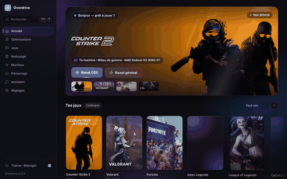

## Aperçu

| Intro au lancement | Accueil |
| --- | --- |
| 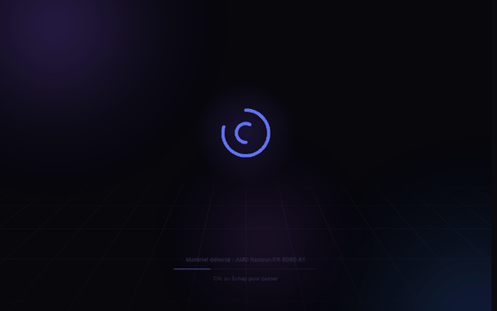 | 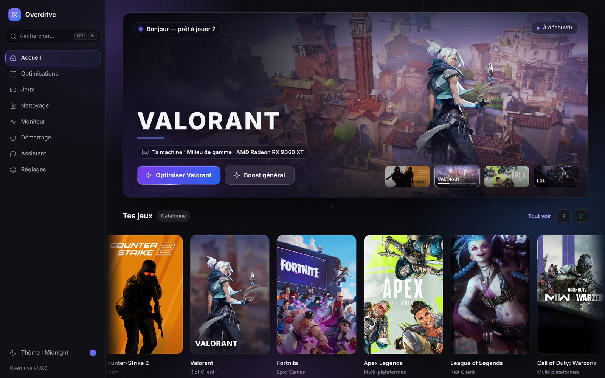 |

| Page Jeux | Fiche CS2 |
| --- | --- |
| 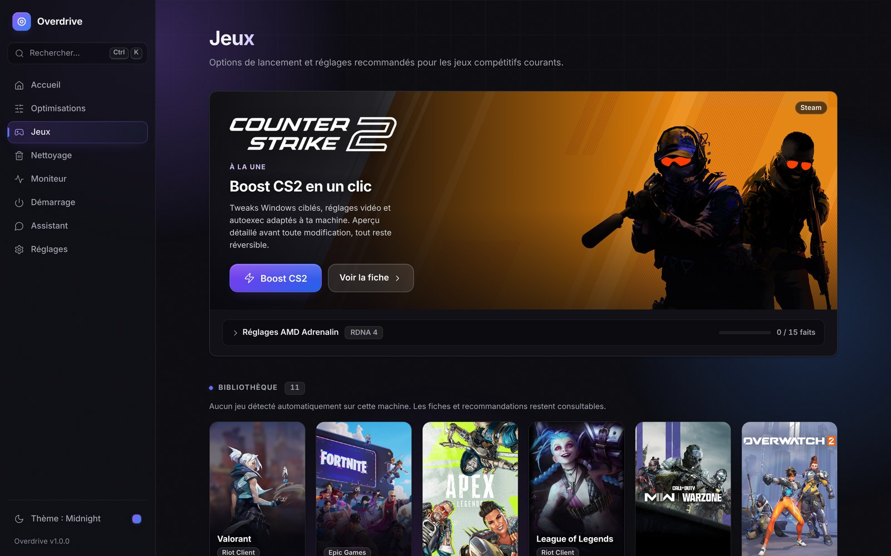 | 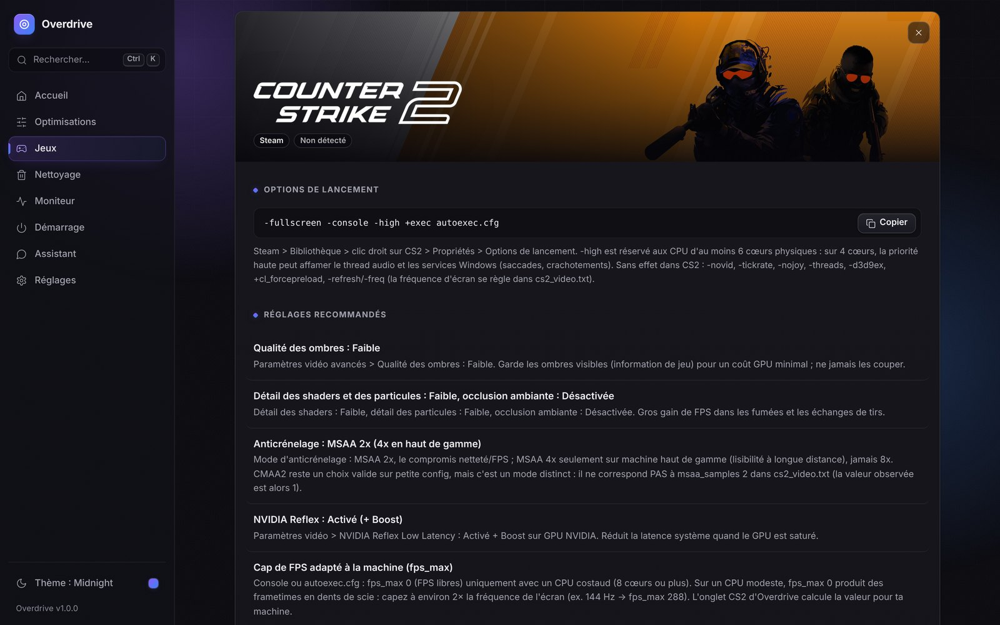 |

| Réglages AMD Adrenalin pour CS2 | Optimisations |
| --- | --- |
| 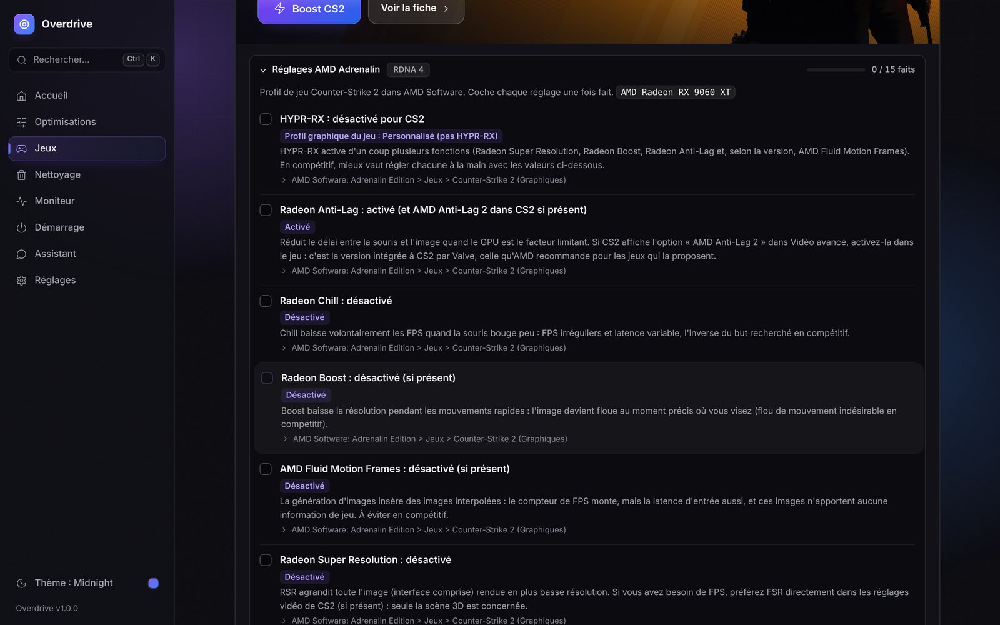 | 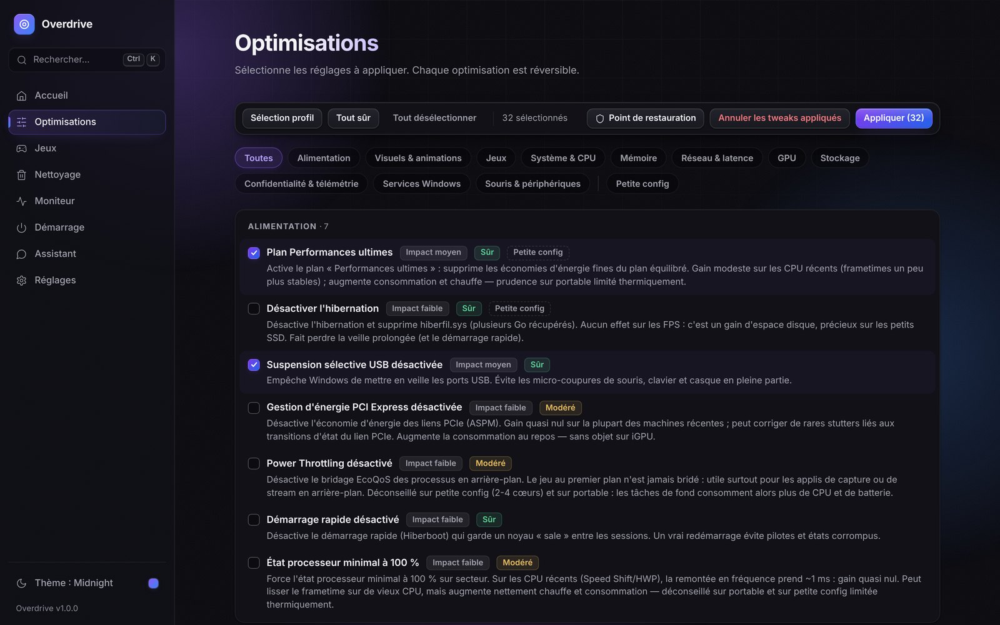 |

| Palette de commandes (Ctrl+K) | Thèmes : Midnight, Océan, Rose, Clair |
| --- | --- |
| 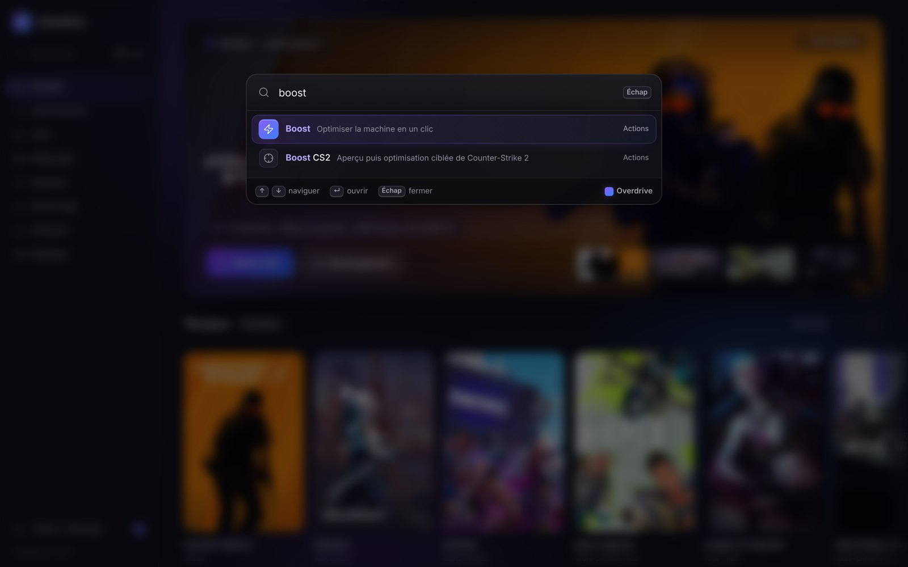 | 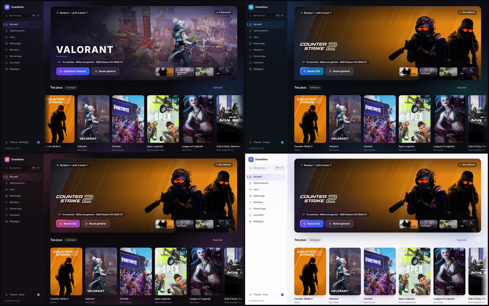 |

<details>
<summary>Plus de captures</summary>

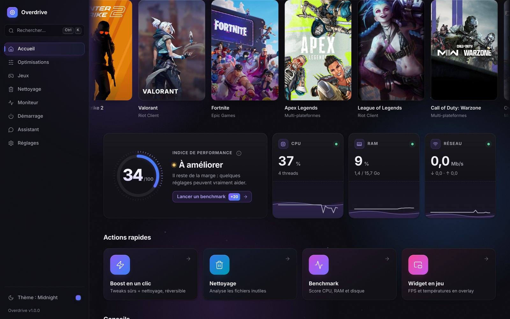
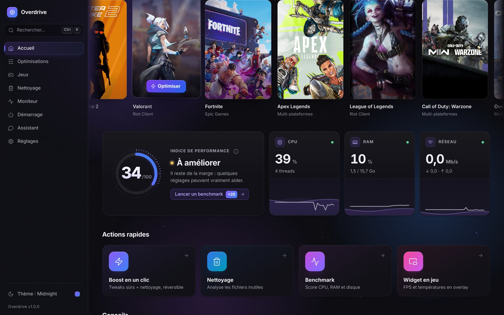
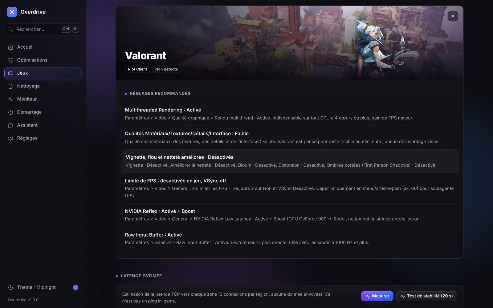
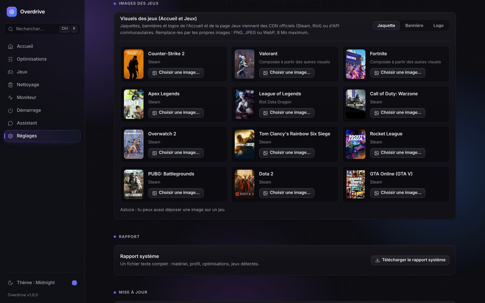
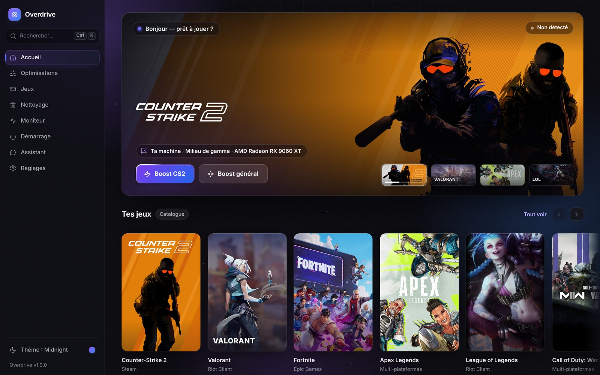

</details>

> Captures réalisées sur une configuration simulée (Radeon RX 9060 XT, Ryzen 5 8400F,
> 16 Go). Les visuels des jeux appartiennent à leurs éditeurs ; ils sont téléchargés par
> l'application depuis leurs CDN et ne sont pas redistribués dans ce dépôt.

---

## Téléchargement

1. Récupère `Overdrive.exe` dans la [dernière Release](../../releases/latest).
2. Lance-le. Windows demande l'élévation administrateur (UAC) : c'est attendu, les
   optimisations modifient des réglages système.
3. Si SmartScreen affiche « Windows a protégé votre ordinateur », clique sur
   **Informations complémentaires** puis **Exécuter quand même** (exécutable non signé,
   construit publiquement par GitHub Actions depuis ce dépôt).

Au premier lancement : une courte intro, puis un questionnaire de 7 questions qui établit
ton profil (FPS maximum, latence minimale, équilibré, stream ou petite config) et
propose de lancer le widget au démarrage de Windows ou au lancement d'un jeu.

## Fonctionnalités

### Interface
- Design sombre « Midnight » façon Raycast, 5 thèmes (Midnight, Océan, Émeraude, Rose,
  Clair) et 3 niveaux d'animation (maximum, réduites, désactivées).
- Accueil cinématique : bannière du jeu mis en avant (zoom lent, parallaxe à la souris,
  rotation entre tes jeux), indice de performance animé, tuiles live, carrousel de
  jaquettes en 3D.
- Palette de commandes **Ctrl+K** pour tout faire au clavier.
- Toutes les animations se mettent en pause dès qu'un jeu tourne : zéro coût en FPS.

### Jeux — 12 titres avec leurs vrais visuels
Counter-Strike 2, Valorant, Fortnite, Apex Legends, League of Legends, Call of Duty
Warzone, Overwatch 2, Rainbow Six Siege, Rocket League, PUBG, Dota 2 et GTA Online.
Jaquettes, bannières et logos officiels (CDN Steam, Data Dragon de Riot, API
communautaires pour Valorant et Fortnite), mis en cache localement et remplaçables par
ta propre image. Pour chaque jeu : détection d'installation, options de lancement à jour
et réglages concrets.

### Counter-Strike 2
- **Boost CS2 en un clic** : aperçu étape par étape, puis optimisations Windows ciblées,
  réglages vidéo adaptés au niveau de ta machine (appliqués à `cs2_video.txt` avec
  sauvegarde préalable, refus si le jeu tourne) et autoexec avec `fps_max` calculé
  depuis la fréquence réelle de ton écran.
- **Réglages AMD Adrenalin** du profil CS2 (Anti-Lag, Chill, Boost, HYPR-RX…), adaptés à
  l'architecture de la carte (RDNA 4 jusqu'à Polaris).
- Convertisseur de sensibilité entre jeux, 12 viseurs inspirés de joueurs pros, coffre
  de sauvegarde des configs.

### Optimisations — 84 réglages réversibles
Classées en 11 catégories, chacune avec son **impact** et son **niveau de risque**
(confirmation obligatoire pour les avancées), un badge **petite config** pour celles qui
aident vraiment les machines modestes, et une **annulation fidèle** qui restaure l'état
d'origine relevé sur ta machine. Point de restauration intégré.

> Par principe, Overdrive **ne touche jamais** aux mitigations de sécurité
> (Spectre/Meltdown) ni à la protection en temps réel de Windows Defender.

### Et aussi
- **Conseils automatiques** : écran qui ne tourne pas à sa fréquence maximale, RAM
  sous sa vitesse nominale (EXPO/XMP), barrette unique, overlays coûteux, pilote GPU
  ancien.
- **Widget en jeu** : FPS, CPU, RAM, températures, entièrement personnalisable,
  affichable/masquable avec Ctrl+F10, mode jeu automatique.
- **Moniteur temps réel**, activité réseau par application, test de stabilité réseau.
- **Nettoyage** des caches (temporaires, shaders DirectX/NVIDIA/AMD, Windows Update),
  débloat des applications préinstallées, programmes au démarrage.
- **Benchmark** avant/après, rapport système exportable, mise à jour intégrée.
- **Assistant IA** (Groq, OpenAI, Anthropic, Gemini) avec le contexte de ta machine et
  des boutons « Appliquer » ; clés API chiffrées localement.

## Utilisation

| Commande | Effet |
| --- | --- |
| `Overdrive.exe` | Fenêtre native (double-clic) |
| `Overdrive.exe --widget` | Lance uniquement le widget en jeu |
| `Overdrive.exe --server` | Mode serveur local : interface sur http://127.0.0.1:8787 dans ton navigateur |
| `Overdrive.exe --server --host 0.0.0.0` | Accès depuis le réseau local, protégé par un jeton affiché au démarrage |
| `Overdrive.exe --browser` | Force l'ouverture dans le navigateur |
| `--port 9000` | Change le port d'écoute |

## Développement

```bash
pip install -r requirements.txt
python run.py --server        # http://127.0.0.1:8787
```

Fonctionne aussi sous Linux/macOS pour le développement : l'interface et l'API
tournent, les optimisations Windows sont affichées à titre informatif.

```
overdrive/
├── server.py           # API REST (FastAPI)
├── main.py             # lanceur : fenêtre native, navigateur, serveur ou widget
├── widget.py           # widget en jeu
├── core/
│   ├── tweaks/         # catalogue des 84 optimisations + moteur (instantané d'origine)
│   ├── games/          # 12 jeux, détection Steam/hors Steam, CS2
│   ├── gameart.py      # visuels des jeux (téléchargement, cache, images perso)
│   ├── cs2boost.py     # Boost CS2 en un clic
│   ├── amd.py          # réglages AMD Adrenalin et conseils Ryzen
│   ├── hardware.py     # détection matériel et niveau de la machine
│   ├── insights.py     # conseils automatiques
│   ├── ai/             # fournisseurs IA + assistant contextuel
│   └── …               # moniteur, réseau, nettoyage, benchmark, widget, etc.
└── web/                # interface (HTML/CSS/JS, aucune dépendance)
    ├── app.js          # application
    ├── home.js         # accueil cinématique
    ├── intro.js        # intro au lancement
    ├── motion.js       # moteur d'animations
    └── palette.js      # palette de commandes Ctrl+K
```

L'exécutable est construit par GitHub Actions ([workflow](../../actions)) : test de
fumée sous Linux, puis PyInstaller sous Windows et publication en Release.
`python build_exe.py` reproduit le build localement.

## Sécurité et confidentialité

- Aucune télémétrie, aucun compte. Les seules connexions sortantes : les visuels des
  jeux (CDN Steam et Riot, API communautaires valorant-api.com et fortnite-api.com), la
  vérification de mise à jour (GitHub), le test de latence vers des serveurs publics, les
  appels à l'API IA que tu configures et l'installation de programmes via winget.
- Serveur local limité à `127.0.0.1` par défaut ; l'exposition réseau est un choix
  explicite (`--host`) et exige alors un jeton d'accès.
- Chaque optimisation est réversible depuis l'application ; crée un point de
  restauration avant d'appliquer des réglages avancés.

## Avertissement

Overdrive modifie des réglages de Windows. Les optimisations proposées sont documentées
et réversibles, mais tu les appliques sous ta responsabilité. Crée un point de
restauration (bouton intégré) avant d'appliquer des réglages marqués « avancé ».

## Licence

[MIT](LICENSE) pour le code. Les visuels des jeux restent la propriété de leurs
éditeurs (voir [THIRD_PARTY.md](THIRD_PARTY.md)).
